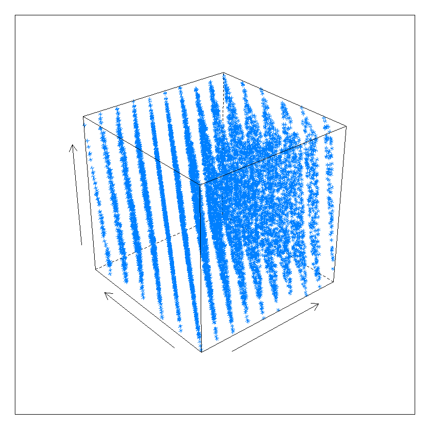
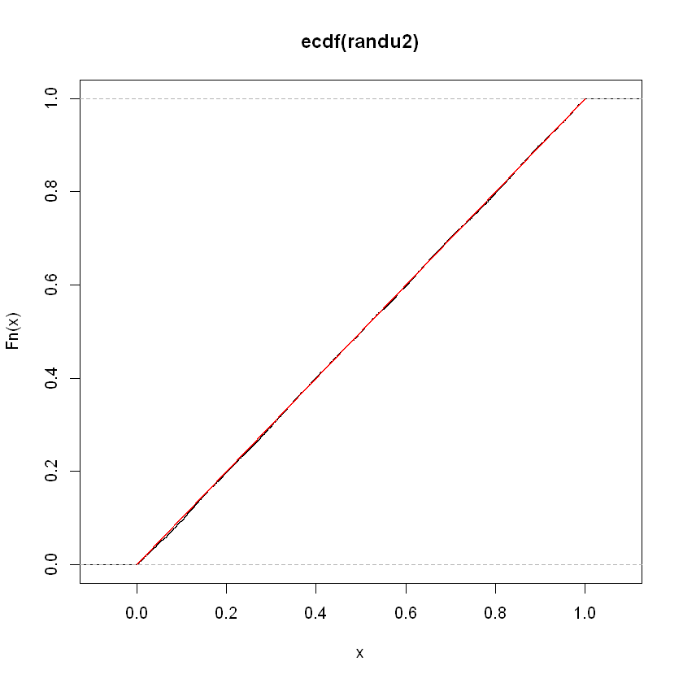

```R
###############Aufgabe 1####################
install.packages("plotrix",repos = "http://cran.us.r-project.org")
install.packages("bootstrap",repos = "http://cran.us.r-project.org")
install.packages("Rmisc",repos = "http://cran.us.r-project.org")


```

    Your code contains a unicode char which cannot be displayed in your
    current locale and R will silently convert it to an escaped form when the
    R kernel executes this code. This can lead to subtle errors if you use
    such chars to do comparisons. For more information, please see
    https://github.com/IRkernel/repr/wiki/Problems-with-unicode-on-windowsInstalling package into 'C:/Users/User/Documents/R/win-library/3.4'
    (as 'lib' is unspecified)
    Warning message:
    "package 'plotrix' is in use and will not be installed"Installing package into 'C:/Users/User/Documents/R/win-library/3.4'
    (as 'lib' is unspecified)
    Warning message:
    "package 'bootstrap' is in use and will not be installed"Installing package into 'C:/Users/User/Documents/R/win-library/3.4'
    (as 'lib' is unspecified)
    Warning message:
    "package 'Rmisc' is in use and will not be installed"


```R
library("bootstrap")
library("Rmisc")
library("plotrix")
pi_sim = function(anz_iter = 10000){
set.seed(10)
s= runif(anz_iter, max = 1, min = -1+ 1/1000000000)
t= runif(anz_iter, max = 1, min = -1+ 1/1000000000) 
#### Kreis
bool1 =  (s^(2)+t^(2)<1) # machen boolische werte, um dann fur den kreis zu verwenden.
unt_kr_s = s[bool1]# Die Punkte liegen unter dem Kreislinie.
unt_kr_t = t[bool1]# Die Punkte liegen unter dem Kreislinie.
pis = rep(0,anz_iter)
for(i in 1:anz_iter){
  x=runif(i, max = 1, min = -1+ 1/1000000000)
  y= runif(i, max = 1, min = -1+ 1/1000000000)
  bool2 =  (x^(2)+y^(2)<1)
  pis[i] = (length(x[bool2])/length(x))*4
}
par(mfrow = c(1,1))
plot(s[!bool1],t[!bool1],asp=1) # Mit diesem Befehl zeigen wir ein Quadrat.
points(unt_kr_s,unt_kr_t, col = "red") # Ein Bild von einem Kreis.
draw.circle(0, 0, 1, nv = 1000, border = NULL, col = NA, lty = 1, lwd = 1) # Mit der Hilfe von Funktion aus Plotrix package.
plot(x=1:anz_iter, y=pis, type="l",xlab= "Anzahl der Iterationen", ylab= "Wert von Pi") # Ein Plot mit der Veränderung von pi, wenn die Iterationanzahl vergrößert.
abline(h=pi, col="red") # Eine rote Linie ist pi Zahl, um die Abweichungsanzahl mit pi zu sehen.
title("The value of Pi", outer=TRUE)
print((length(unt_kr_s)/length(s))*4)
}
```

    Your code contains a unicode char which cannot be displayed in your
    current locale and R will silently convert it to an escaped form when the
    R kernel executes this code. This can lead to subtle errors if you use
    such chars to do comparisons. For more information, please see
    https://github.com/IRkernel/repr/wiki/Problems-with-unicode-on-windows


```R
pi_sim()
```


    [1] 3.1432
    


In dieser Aufgabe wollen wir Pi zahl simulieren.
Im ersten Plot sehen wir rote Datenpunkte. Wir nehmen dann der Anzahl von diesen Punkten dividieren durch gemeinsamen Anzahl und muktiplizieren mit 4, um pi anzahl zu bekommen.
Im zweiten Plot sehen wir die Veranderung der Abweichung von Pi anzahl, wenn wir die Anzahl von Iterationen verandern.


```R
########################Aufgabe2##########################

```


```R
library(lattice)

random2d.plot <- function(x)
{
  xi <- x[-length(x)]
  yi <- x[-1]
  plot(xi, yi, axes=T, xlab="",ylab="", cex=0.6)
}

random3d.plot <- function(x)
{
  xi <- x[1:(length(x)-2)]
  yi <- x[2:(length(x)-1)]
  zi <- x[3:length(x)]
  
  cloud(zi ~ xi * yi,xlab="",ylab="",zlab="", cex=0.6)
}

#############Linear Congruenutial Generator##################

lcg = function(length , seed, a, b, m){
  
  resu = numeric(length)
  resu[1] = seed 
  for (i in 1:(length-1)) 
      resu[i+1] <- ((a * resu[i] + b) %% m)
  return(resu)
}
#############################################################
```


```R
#################### Erster LCG #######################################  
erste_seed =  123456789 # Folien.

randu <- lcg(length=10000, seed = 123456789,a = 65539, b = 0, m = 2^31) / 2^(31)

random2d.plot(randu)
random3d.plot(randu) 
```





Das ist unsere erste LCG Randu. Alle Parametern haben wir von der vorlesung genommen.Als wir sehen gibt es da eine serielle Korrelation.


```R
plot(ecdf(randu)) # Mit ecdf finden wir eine empirische CDF(cumulative distribution funciton).
theor_cdf = seq(0, 1, length = 10E3 + 1)
lines(theor_cdf, punif(theor_cdf), col = "red") # Hier wollen wir mit einem theoretischen CDF von Uniform Verteilung vergleichen.
# Und als wir sehen ist es ziemlich gleich.
```


Als wir sehen, dass unser erster LCG ist uniformverteilt.


```R
ks.test(randu, "punif") # Die Uniformverteilungshypohtese wird nicht verworfen. Die Sample 
#kann aber durch Umordnung gerettet werden.
```


    
    	One-sample Kolmogorov-Smirnov test
    
    data:  randu
    D = 0.0078526, p-value = 0.5683
    alternative hypothesis: two-sided
    


Wir verwerfen die Uniformverteilungshypothese nicht.


```R
#Mit diesem Algorithmus haben wir eine passendes Seed gefunden.
res = unclass(Sys.time())
temp <- lcg(length=10000, seed = res,a = 65539, b = 0, m = 2^31) / 2^(31)
print(random3d.plot(temp))

```


Mit diesem Algorithmus konnen wir dann aussuchen den Seed, der uns eine serielle Korrelation gibt.


```R
###############################Zweiter LCG ########################################
zweite_seed =  1523963818

randu2 <- lcg(length=10000, seed = zweite_seed,a = 65539, b = 0, m = 2^31) / 2^(31)

random2d.plot(randu2)	
random3d.plot(randu2) # Es liegt hier auch eine serielle Korrelation.
```


Wir verwenden den Seed, den wir mit dem obigen Algorithmus gekriegt haben.
Und als wir sehen hier gibt es auch eine serielle Korrlation.


```R
plot(ecdf(randu2))
theor_cdf <- seq(0, 1, length = 10E3 + 1)
lines(theor_cdf, punif(theor_cdf), col = "red")
```





Sehen wir wieder eine Uniformverteilung hier.


```R
ks.test(randu2, "punif") 

```


    
    	One-sample Kolmogorov-Smirnov test
    
    data:  randu2
    D = 0.0067285, p-value = 0.7558
    alternative hypothesis: two-sided
    


  Hier verwerfen wir die Uniformverteilungshypothese auch nicht.


```R
###### Jetzt implementieren wir einen verbesserten LCG ###############
randu2_ord = order(randu2) # Wir nehmen order von dem zweiten randu.

new_randu = randu[randu2_ord] # Und mischen erste randu mit randu2_ord
```


```R
######## 2a) ##############
chisq.test(table(cut(new_randu, breaks = seq(0, 1, length = 101))), 
           p = rep(1 / 100, length = 100))

hist(new_randu, probability = TRUE, xlab = "verbesserter LCG", ylab = "Dichte",
     breaks = seq(min(new_randu), max(new_randu), length = 11), col = "yellow", 
     main = "Verteilung des verbesserten LCG", font.lab = 2, font.main = 2, cex.axis = .85)

lines(seq(0, 1, length = 10000), dunif( seq(0, 1, length = 10000)), col ="red", lwd=5)

legend("top", "Dichte von uniformverteilung", xpd = NA, bty = "n", col = "red", lty = 1, lwd = 4, 
       inset = c(0, -0.062), xjust = 0.5, text.font = 2, text.col = "black")
```


    
    	Chi-squared test for given probabilities
    
    data:  table(cut(new_randu, breaks = seq(0, 1, length = 101)))
    X-squared = 83, df = 99, p-value = 0.8763
    


Als wir sehen hier, dass fur verbesserter LCG wir auch keine Uniformverteilungshypothese verwerfen. 


```R
############ 2)b #################
ks.test(new_randu, "punif")


plot(ecdf(new_randu), main = "Vergleich der Verteilung des verbesserten LCG mit der uniformverteilung")

grid <- seq(0, 1, length = 10E3 + 1)
lines(grid, punif(grid), col = "red")

legend(x = -0.125, y = 1, c("verbesserter LCG", "uniformverteilung"), 
       col = c("black", "red"), bty = "n", lty = 1, lwd = 3)

```


    
    	One-sample Kolmogorov-Smirnov test
    
    data:  new_randu
    D = 0.0078526, p-value = 0.5683
    alternative hypothesis: two-sided
    


Auch mit dem Kolmogorov-Smirnov test konnen wir die Annahme von der Uniformverteilung nicht verwerfen.


```R
########## 2)c ################
random2d.plot(new_randu)
random3d.plot(new_randu) # Als wir sehen hier gibt es keine serielle korrelation.


```


Hier gibt es schon keine serielle Korrelation.


```R
######################Aufgabe 3###########################
################## Funktion fur die Simulation #############
bild_sim = function(anz_sim = 1000, packung_grs = 5){
  zuf = sample(1:682)
  i=1 
  red = zuf
  anzahl = numeric(anz_sim)
  for(j in 1:anz_sim){
    i=1
    red = zuf
    while((length(red) == 0) != TRUE ){
      p=sample(zuf,5)
      red = red[!(red %in% p)]
      i=i+1
    }
    anzahl[j] = i
  }
    print(anzahl)
  }
########################################################################
```


```R
system.time(bild_sim ()) 

```

       [1] 1012 1441 1226  905  948 1251  811 1369  953  866  958 1045  924  970
      [15]  941 1136  880  953 1018 1142  926  942  796 1230  905  998 1419  921
      [29]  928 1065  884  885 1334  690  867  866  834  854 1142 1312  980  732
      [43] 1724  892 1075  794 1030  852  864  736  923  720  763  895  904  953
      [57]  939  830 1135  873  719  834  831 1019  806  898 1027 1030  785  836
      [71]  865  758  891  876  939  861  889  882  986 1289 1056  775 1389 1288
      [85] 1054  904  869  993  951  860  819  847  937  920  737  914 1001 1137
      [99]  876  885  835  990 1051 1152  959  827 1048  782 1199  756  802  931
     [113]  799 1241  980  793  863  814 1115 1062 1426  925  975  940  735 1297
     [127]  902 1203  901  861  975  651  834 1046 1233  864 1396  924 1093  771
     [141]  902  820 1457  943  781  947  903 1051  879  805  750  986 1045 1030
     [155] 1011  807  869 1105 1023  729 1109  881  796  939  943 1088 1648  854
     [169]  801  925 1093 1046 1044 1268  896 1084 1041  855 1068 1285 1113  839
     [183]  969  775 1294  918 1029 1008  796  797  768 1016  806  736 1024  977
     [197] 1306  989  853  857 1266 1203 1062  776  741  812 1059 1119  762 1030
     [211] 1294  841  920 1081  802  867 1320 1171  912 1216 1085  790  969  825
     [225]  992  939  821 1213 1017  988 1376  926  783  806  912  857  970  923
     [239]  872 1021  871  840  824  932 1138  964  934 1092 1106  933  859  793
     [253]  797  839  732  738  940 1445 1026 1189 1123 1338 1067 1024  915 1182
     [267] 1083  906  906  871 1244 1012  947  793 1482  974  824  895  957  811
     [281]  926  869  727 1233  817  864 1084 1182  940  872  978  928 1040  793
     [295]  904  825 1469  928  842  787  707 1820  847 1462  751 1358  948  851
     [309]  687 1022  896  890  968  846 1248  907  895  787  919 1009  720  991
     [323] 1084 1038  837  963 1335 1103  899 1051  840  773  896  903 1046 1029
     [337]  922  862  982  920 1137  947  898  822  848  782  984 1091 1000 1026
     [351]  895 1128  737 1746  797 1147 1082 1088  880  753  917  702  926  968
     [365] 1013 1034 1007  794  867 1130  903  810  995 1196 1080 1054 1236  838
     [379] 1154 1042  899 1196  911  907  885 1108  940  817  890  798 1019  817
     [393]  971  787  946  913 1310 1087 1214  902  952  789  939  815  797  888
     [407]  842  772  943  952  923  761  830 1193 1119 1059 1088  906  850  994
     [421]  763 1001 1032  892  752  915  819  832  894  882  893  808 1180  840
     [435]  780  884  930  926  851  907  822  817  833 1109  950  786  577  888
     [449] 1008  824 1194  746  769  808 1025  932 1039  852  947  821 1012  846
     [463]  947  834  737  706 1045  808  956  986 1060  913  971 1345  736  943
     [477] 1265 1158 1270  835  907  739  719 1100  946  860  884  804 1179 1086
     [491]  817  929  962 1275  955  922 1024 1021  782  831  937 1195  862  836
     [505] 1173  914 1424  895 1050  845  890  910 1035  962  797 1151 1059  886
     [519]  714  972 1135  812  992 1105  986  839  747  817  823  858  682  899
     [533]  918  807  872 1059  858  823  816 1045 1237  857 1053 1037  750 1267
     [547]  926  947  785  864 1017  873 1069 1022  996  942 1056  888 1027 1110
     [561]  997 1155 1020  997  889  867  919  779 1095  812 1176  961 1005  812
     [575] 2003  769 1307  800  971 1085  878  964  679  896  819  845  866 1030
     [589]  823 1049 1367 1060  798 1018 1040 1150  831  954  984  777  817 1135
     [603]  829  894 1069 1033  905 1148  991 1234  902 1463  970 1166  870  978
     [617] 1071 1105  904  904  741 1035 1111  904  930 1160  937 1009  716  870
     [631]  978  796  896  997 1083 1027  977  679 1276 1042  829  721  923 1454
     [645]  974  778 1048  880  801  922 1299 1033  944  804  935  737  819  855
     [659]  908  875 1047 1002  873  784  798 1078 1121 1024  888  783  771 1187
     [673]  946  843 1007 1080  914  829 1129 1268 1005  845  846  781  840 1063
     [687] 1182  810 1091  956  735 1307 1018  981 1163  987 1159  781  783 1213
     [701]  647 1043 1163 1020  785  716  723  988 1325 1007  835  822  869 1174
     [715] 1160  972 1032 1160  867 1083  969  806 1145  932  932  762 1071  938
     [729] 1213  991  824 1441  928 1008  916  788 1292  937  735  943 1016  889
     [743]  815  954 1373  710  965  835  784  999 1149 1110 1092  874  926 1059
     [757] 1017  950 1039  844  788 1217  741 1171 1029 1329  782  637 1015 1117
     [771]  796  905  928  898  811 1137  938  839 1616 1036 1004 1078  887  928
     [785]  940 1004 1172  904  771 1108  927  898  746  900 1048 1028  685 1122
     [799]  861  965  900 1027 1136 1188  792  966 1151  852 1263 1215  827  894
     [813] 1121  936 1002 1009  998  807  958  973 1467  964  939 1162  858  735
     [827]  754  929  665  757 1079  987  892 1230 1020 1284 1045  925  873  984
     [841]  820  870  957  814 1085  967 1075 1115  943  882  829 1080  913 1154
     [855]  745 1083 1279  925  925  931  972  997  774 1102  860  765 1516  932
     [869]  924 1346  836 1825  907  797  860  816 1099  944  826  922  906  728
     [883]  956  804 1234 1625  824  859  878 1054 1153  925 1010  909  782  907
     [897] 1107 1293 1115  992  998  908 1083  716 1161 1081  917 1008 1085  683
     [911]  785  938  868  971 1077  722  886  769  907  814  693  954  881 1267
     [925] 1345  886  892 1140  922  778  971  748  808 1148  912 1111 1295  957
     [939] 1075  853  824  909  934 1121  882  866  818  957 1230 1052 1106  887
     [953] 1010  995 1123  752  853 1210 1097 1038 1132  965  822 1035  742  864
     [967]  876 1432  727  664 1081 1420 1056  810  794  819  683  831  728 1041
     [981]  786  967 1063  978 1059  965 1007 1439  636 1304  783  842  864 1161
     [995] 1012  898  817 1117  994 1012
    


       user  system elapsed 
      20.05    0.03   20.61 


Das ist unsere erste Funktion fur die Simulation. Wir simulieren wie viele Packungen braucht man, um die ganzae Kollektion zu sammeln.


```R
sim = bild_sim()
bild_zeichnung = function(anzahl){
preis = anzahl*0.9
t_anzahl=CI(anzahl)
t_preis=CI(preis)
#########Verschiedene Statistische Daten.###############################
stat_anzahl = list(mean_sd=c(mean=mean(anzahl), SD= sd(anzahl)),quant_anz =  quantile(anzahl), ci =  paste0(c("[",t_anzahl["upper"]), c(t_anzahl["lower"],"]"), collapse = ":") )
stat_preis  =   list(mean_sd=c(mean=mean(preis), SD= sd(preis)), quant_anz =  quantile(preis),ci =  paste0(c("[",t_preis["upper"]), c(t_preis["lower"],"]"), collapse = ":"))
stat_daten = list(stat_anzahl = stat_anzahl,stat_preis = stat_preis,t_anzahl = t_anzahl,t_preis = t_preis)
#Confidence Interval fur Anzahl.
par(cex=0.75, cex.axis=0.75, cex.lab=0.75)
par(mfrow=c(1,1))
plot(x=1:2000, y=1:2000, ylim=c(0,4), type="n", xlab="Anzahl")
lines(y=c(1,1),x=c(as.numeric(stat_daten$t_anzahl["lower"]),as.numeric(stat_daten$t_anzahl["upper"])), lty="dotted", col="blue")
lines(x=c(as.numeric(stat_daten$t_anzahl["lower"]),as.numeric(stat_daten$t_anzahl["lower"])), y=c(0.5,1.5), col="red")
lines(x=c(as.numeric(stat_daten$t_anzahl["upper"]),as.numeric(stat_daten$t_anzahl["upper"])), y=c(0.5,1.5), col="red")
abline(v=stat_daten$stat_anzahl$mean_sd["mean"], lty="dotted", lwd= 2)
legend(x=0, y=4, legend =paste(c("CI", "mean"),c(paste(c(stat_daten$t_anzahl["lower"],stat_daten$t_anzahl["upper"]) , collapse =";"),stat_daten$stat_anzahl$mean_sd["mean"]),sep=" : "), col=c("blue", "black"), lty="dotted", lwd= c(1,2), cex=0.60)
#Confidence Interval fur den Preis.

plot(x=1:2000, y=1:2000, ylim=c(0,4), type="n", xlab="Preis")
lines(y=c(1,1),x=c(as.numeric(stat_daten$t_preis["lower"]),as.numeric(stat_daten$t_preis["upper"])), lty="dotted", col="blue")
lines(x=c(as.numeric(stat_daten$t_preis["lower"]),as.numeric(stat_daten$t_preis["lower"])), y=c(0.5,1.5), col="red")
lines(x=c(as.numeric(stat_daten$t_preis["upper"]),as.numeric(stat_daten$t_preis["upper"])), y=c(0.5,1.5), col="red")
abline(v=stat_daten$stat_preis$mean_sd["mean"], lty="dotted", lwd= 2)
legend(x=0, y = 4, legend =paste(c("CI", "mean"),c(paste(c(stat_daten$t_preis["lower"],stat_daten$t_preis["upper"]) , collapse =";"),stat_daten$stat_preis$mean_sd["mean"]),sep=" : "), col=c("blue", "black"), lty="dotted", lwd= c(1,2), cex=0.55)
# Jetzt wollen wir Qauntile zeichnen.
#Fur den Anzahl
boxplot(anzahl, ylab= "Anzahl")# Für das einzige simulation.
title("Boxplot")
#Fur den Preis.
boxplot(anzahl*0.9, ylab= "Preis")# Für das einzige simulation.
title("Boxplot")
print(stat_daten)# Hier habe wir eine Liste von verschiedenen statistische Berechnungen fur den Preis.
}
```

       [1]  934  872 1118  967  887  998 1070 1222  918 1279  943  865  880 1034
      [15]  948 1034 1037  838  835 1042  732  803  885  924 1088  986 1319  946
      [29]  899  731  834  931 1038 1218 1354  897 1227  931 1043  906  810  899
      [43] 1179 1046  790  917 1069  810 1058  701  972 1107  892  925 1163  806
      [57]  900  840  929 1019 1196 1254 1081  837 1038 1058  933  989 1073 1349
      [71]  933 1474  776  807 1143 1178  902  916  959  869  860  977 1021  922
      [85] 1021 1118  840  857  884  648 1102  989  832  972  935  722  893  859
      [99]  787 1108 1076 1254  889 1033  963  770  759  861  938  930 1109 1208
     [113] 1120  738  846  887 1007  853  970  976  923  690 1144  937  980 1030
     [127]  680  884 1179  964  750  996  965  841 1093 1168 1076 1096  862 1064
     [141]  907 1097  909  716  828 1082  818 1182 1080 1242 1061  865 1155  943
     [155] 1266 1137 1000  911 1256  877  862  961 1083  964  963  795  855  947
     [169]  691 1002  868 1258  856  941 1205 1146  814 1090  714 1114 1312  928
     [183]  730 1008  854  863  922 1262  866  925  715  964  735 1040 1148 1057
     [197] 1208 1032  845  800  789 1409 1016  870 1514  945  843  807 1194 1098
     [211]  878  985 1201  774 1051 1109  771  842  956 1066  858  840 1065  926
     [225]  757  933  952  802  897 1050  798  992  863  749 1046 1120  848 1158
     [239]  800  909  901 1046  987  777 1063  899 1277 1035 1067  991  964  919
     [253]  893  859 1016  822  894  994  745  900  867 1084 1576  949  845  803
     [267]  728  917 1022  914  673  725  985  935  781  909 1160  819  787  918
     [281]  664 1245 1301 1187  990  837  987 1099  745  803 1193  739  900 1122
     [295] 1070  986  822 1200 1016  843  903 1077 1129 1125  896 1016  984  874
     [309] 1020 1117  996  813  920  904  964  756 1150  993 1220  896  992  823
     [323]  984  839  892 1167  923  970  802  806  808 1113  628 1318  733  912
     [337] 1028  919 1063 1019 1183 1068  791 1082 1369  858 1071  860 1088  842
     [351]  961 1155  741  964 1264  934  824  949  958 1015 1155 1055  930  762
     [365]  738  850 1039 1167  818 1124 1107  955  909  797  980  955 1014 1210
     [379] 1054 1140  984  788  953  902  830  999  827 1256  947 1036  992 1006
     [393] 1109 1000  895 1016  818 1238  987  825  813 1027  915 1176  911 1053
     [407] 1280  908  979  803 1012 1055  854  905  897  754  760  916 1065  923
     [421]  684  859 1563  905  953  833  961  884  893 1079  867  985 1158 1133
     [435]  950 1134  870 1043  756  992  941  943 1169  768  726 1398 1017 1098
     [449]  990  831  795  879  829 1121 1173  967 1118 1048  984  916  798 1150
     [463] 1138  889  883  717  944  863  907  976  870  830 1006  963  875  826
     [477]  998  821  879  744  945 1078  879  979  920 1135 1077 1079 1005  873
     [491] 1024  979  830  819  755  819  671  900  811 1214  865  931 1053  852
     [505]  975  738 1040  916  939  810  774  874 1012  939  884 1035  800 1204
     [519]  901  838 1054  947  953  789  821  777  904 1024  959  932  913 1110
     [533] 1010 1171  939  929 1139 1137  885  807  970 1563 1149  900  787  879
     [547]  679 1106  946  978  894 1146 1136  742 1023  805  945 1083 1323 1097
     [561]  921  796  979 1027 1052  840  839  714  711  868  832 1015  735 1193
     [575]  926 1373 1114  923 1003 1136  771 1017 1132 1146 1024 1115  727 1018
     [589] 1305  822  855  874 1036 1172  799  928  891  858 1153 1333  844 1138
     [603]  897 1019 1079 1078 1304  731  667  938  872  873  770 1008 1205 1068
     [617]  778 1289  993  834  961  821  818 1048  860  851 1185  917 1193 1015
     [631]  840 1254  952  982 1006  802 1000  870  768  810 1156  984  899 1108
     [645]  996  784 1319  835 1023  935 1295  892  701  901 1110  796  761  962
     [659] 1073  858  780 1222  980  978 1082 1158  950  854  870  774  788 1046
     [673]  918  904  883  817  862 1018  794  772  738  917  817  999  945  924
     [687] 1004 1131  961 1230  930  829  966  979  781  982  860  859 1198 1068
     [701]  986 1203  907  987  748 1153  869  893 1075  915 1191 1112  776 1084
     [715]  863 1181  893 1103  876  796 1233 1186 1255  969  916  872  916  998
     [729]  842 1136  888  762 1001 1058  923 1461 1055 1002  840  845 1177  907
     [743]  703 1035  982 1389 1203  857  935  865 1039  935 1381  931 1053 1424
     [757]  816 1034  909  865  866 1520  785  766  923 1050  958  799  917  841
     [771]  936  863  940  863 1033  953 1041  967 1048  741  670  981  873  796
     [785]  886  994  972 1037 1148  880  999  829 1082  792  979 1017  736  799
     [799]  873  839  838  900 1051  801  844  679  982  928  852  995  885 1205
     [813]  821 1221  926 1257  874 1048  889  979  897  834 1030  944 1513 1060
     [827]  918 1000  902  940  805 1021  929  861  807  761  782  824 1710  776
     [841]  780 1002 1052  976 1220  913 1707  981 1287 1103 1032  986 1138  843
     [855]  832 1005  985 1120  827 1204 1294  698 1172 1095  873 1116 1088  981
     [869] 1102 1111  800 1020  845  815 1154  874 1138  786  757 1038 1447 1095
     [883] 1000  967 1090  790  946  765  945 1152  748  798  766 1304 1362  827
     [897]  804 1020 1125  808  898  971 1053 1102  894  907 1852  968  826  838
     [911] 1019  846  841  730  766  839  802  867  782 1379  777 1239 1012  855
     [925]  843 1068  802  987  990 1039 1114 1058  821  766  851  905  794  887
     [939]  988  983  927  856  864  898  962  849  892 1018 1022  971  992  798
     [953]  968  816  923  947  996 1229 1155  808  824  756  918 1255 1007  884
     [967] 1149 1008  793  831  940  929 1042 1151  905  870  867  818  921 1060
     [981] 1145  909 1038  934  962  865  707  838  937  745  790  802 1299  877
     [995]  729  932  880 1010  963 1019
    

Das ist unsere Funktion fur die Zeichnungen.
Diese Funktion zeichnet die Konfidenzintervale und Boxplots fur den Anzahl und fur den Preis.


```R
bild_zeichnung(sim)
```


    $stat_anzahl
    $stat_anzahl$mean_sd
        mean       SD 
    965.0970 160.7622 
    
    $stat_anzahl$quant_anz
         0%     25%     50%     75%    100% 
     628.00  850.75  941.00 1053.00 1852.00 
    
    $stat_anzahl$ci
    [1] "[955.120953543747:975.073046456253]"
    
    
    $stat_preis
    $stat_preis$mean_sd
        mean       SD 
    868.5873 144.6860 
    
    $stat_preis$quant_anz
          0%      25%      50%      75%     100% 
     565.200  765.675  846.900  947.700 1666.800 
    
    $stat_preis$ci
    [1] "[859.608858189372:877.565741810628]"
    
    
    $t_anzahl
      upper    mean   lower 
    975.073 965.097 955.121 
    
    $t_preis
       upper     mean    lower 
    877.5657 868.5873 859.6089 
    
    


```R
######### Aufgabe 4 ############################################
 jahr_ergebniss =  function(g_satz = 5, iter = 1000, npolizzen = 10000, pramie = 300) {
   # Simulation der Schadensfälle  im ersten und zweiten Jahr:
   jahr1 = matrix(rpois(npolizzen * iter, .15), ncol = iter) #Schadensfälle im ersten Jahr
   jahr2 = matrix(rpois(npolizzen * iter, .15), ncol = iter) #Schadensfälle im zweiten Jahr
   # Jetzt berechnen wir die Einzahlungen:
   ein_zahl = pramie * npolizzen #  Einzahlung im zweiten Jahr
   gutschrift  = (g_satz / 100) * pramie * (npolizzen - colSums(jahr1 > 0)) 
   red_einzahlung = ein_zahl - gutschrift # reduzierte Anzahlung nach der Abrechnung der Gutschriften.
   # Berechnung der Auszahlungen:
   kost = lapply(colSums(jahr2), rexp, 1 / 1000)
   aus_zahl = sapply(kost, sum)
   jahr_ergebniss <- red_einzahlung - aus_zahl
   return(jahr_ergebniss)
 }

```

Wir haben ein Programm geschrieben, mit dem wir ein Cashflow simulieren. Wo g_satz fur einen Gutschrift zum Versicherungsnehmer steht.Mit dem pramie konnen wir auch kontrollieren wie viel einer Versicherungsnehmer  pro Jahr zahlt. 


```R
################ 4a) ###################################
 neg_erg <- function(g_satz=5, repetitions = 10){
   w_neg <- 0
   for (i in 1:repetitions){
        w_neg <- w_neg + mean(jahr_ergebniss(g_satz) < 0)
   }
   return(w_neg / repetitions)
 }
  g_satz = seq(0, 100, by = 5)
  neg_erg <- vapply(g_satz, neg_erg, numeric(1))
  names(neg_erg) <- paste0(g_satz, "%") # Als wir sehen, dass fur g_satz=0 kriegen wir immer 0, wollen wir fur all satze das zu testieren.
##############################################
```


```R
neg_erg

```


<dl class=dl-horizontal>
	<dt>0%</dt>
		<dd>0</dd>
	<dt>5%</dt>
		<dd>0</dd>
	<dt>10%</dt>
		<dd>0</dd>
	<dt>15%</dt>
		<dd>0</dd>
	<dt>20%</dt>
		<dd>0</dd>
	<dt>25%</dt>
		<dd>0</dd>
	<dt>30%</dt>
		<dd>0</dd>
	<dt>35%</dt>
		<dd>0</dd>
	<dt>40%</dt>
		<dd>0</dd>
	<dt>45%</dt>
		<dd>0</dd>
	<dt>50%</dt>
		<dd>1e-04</dd>
	<dt>55%</dt>
		<dd>0.0758</dd>
	<dt>60%</dt>
		<dd>0.8166</dd>
	<dt>65%</dt>
		<dd>0.9993</dd>
	<dt>70%</dt>
		<dd>1</dd>
	<dt>75%</dt>
		<dd>1</dd>
	<dt>80%</dt>
		<dd>1</dd>
	<dt>85%</dt>
		<dd>1</dd>
	<dt>90%</dt>
		<dd>1</dd>
	<dt>95%</dt>
		<dd>1</dd>
	<dt>100%</dt>
		<dd>1</dd>
</dl>


Hier haben wir die Funktion, die sagt wie gross ist die wahrscheinlichkeit einen negativen Cash Flow zu kriegen. 
Und es wird immer NULL fur jeden Anzahl von Jahren. Es wird sich andern nur dann, wenn wir einen Gutschriftsatz andern.
Und als wir sehen hier, dass die Wahrscheinlichkeit sich nur ab 50 prozentiger Gutscshrift zu andern anfangt.  


```R
############ 4)b ###############################
 
 ci_jahr_ergebniss <- function(g_satz, konf_niveaue = .9, iter = 1000){
   x = jahr_ergebniss(g_satz, iter)
   konf_grenzen =  c(floor((1-konf_niveaue)/ 2 * iter), ceiling((1-(1-konf_niveaue)/ 2) * iter))
   index_grenzen <- order(x)[konf_grenzen]
   wert_grenzen <- x[index_grenzen]
   ci <- c(wert_grenzen[1], mean(x), wert_grenzen[2])
   names(ci) <- c("Lower", "Value", "Upper") 
   return(ci)
 }
 
```

Mit diesem Funktion bestimmen wir einen empirischen Konfidenzintervall fur das Jahresergebniss.


```R
########## 4)c #####################################
g_satz <- seq(0, 100, by = 5)
ci_ver_satz <- t(sapply(g_satz, ci_jahr_ergebniss))
matplot(g_satz, ci_ver_satz, type = "n", xlab = "Satz", ylab = "Konfidenzinterval",main = "Empirische Konfidenzintervalle fur den Jahresergebniss")
matlines(g_satz, ci_ver_satz, lty = 1, col = c("black","yellow","black"), lwd = 2)
```


Hier  zeichnen wir einen Konfidenzintervall mit den verschiedenen Satze aus 4a). 
