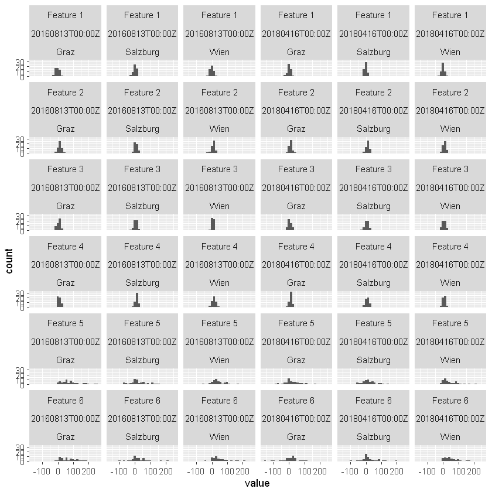
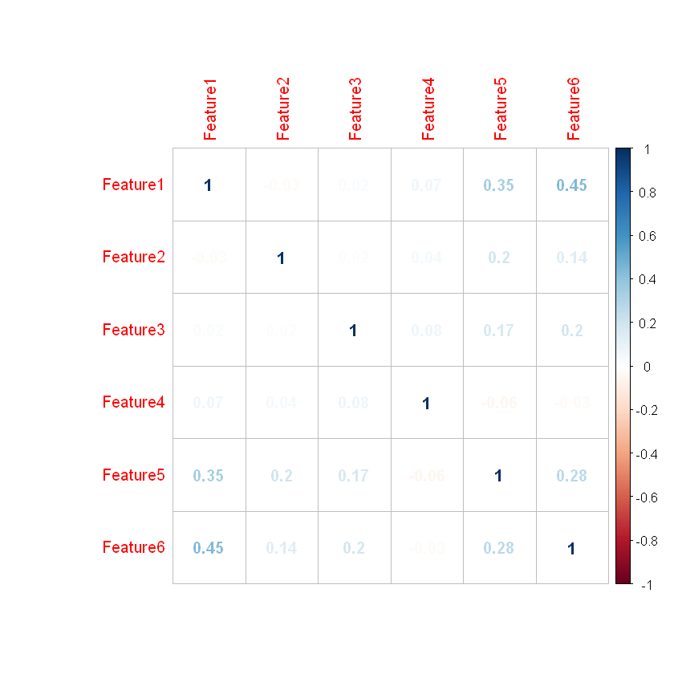
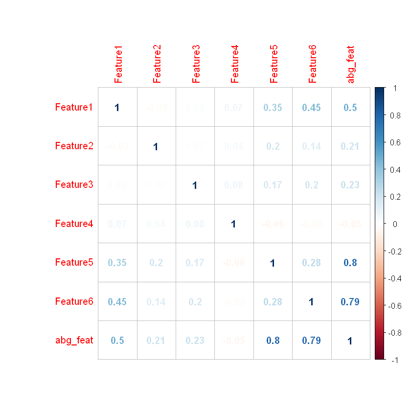
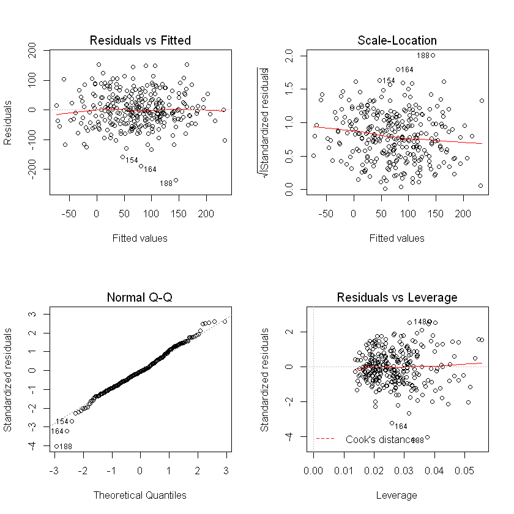

```R
install.packages("dplyr",repos = "http://cran.us.r-project.org")
install.packages("tidyr",repos = "http://cran.us.r-project.org")
install.packages('caret',repos = "http://cran.us.r-project.org")
install.packages("parsedate",repos = "http://cran.us.r-project.org")
install.packages("reshape2",repos = "http://cran.us.r-project.org")
install.packages("plotly",repos = "http://cran.us.r-project.org")
install.packages("corrplot",repos = "http://cran.us.r-project.org")
install.packages('robustbase')
install.packages('lmtest')
install.packages('MASS')
install.packages('mice',repos = "http://cran.us.r-project.org")
install.packages('e1071')
library(dplyr)
library(tidyr)
library("plotly")
library("corrplot")
library(parsedate)
library("reshape2")
library(caret)
library(lmtest)
library(robustbase)
library(mice)
library(MASS)
library(e1071)
```

    Installing package into 'C:/Users/User/Documents/R/win-library/3.6'
    (as 'lib' is unspecified)
    

    package 'dplyr' successfully unpacked and MD5 sums checked
    

    Warning message:
    "cannot remove prior installation of package 'dplyr'"

    
    The downloaded binary packages are in
    	C:\Users\User\AppData\Local\Temp\RtmpABmOsx\downloaded_packages
    

    Installing package into 'C:/Users/User/Documents/R/win-library/3.6'
    (as 'lib' is unspecified)
    

    package 'tidyr' successfully unpacked and MD5 sums checked
    
    The downloaded binary packages are in
    	C:\Users\User\AppData\Local\Temp\RtmpABmOsx\downloaded_packages
    

    Installing package into 'C:/Users/User/Documents/R/win-library/3.6'
    (as 'lib' is unspecified)
    also installing the dependency 'reshape2'
    
    

    package 'reshape2' successfully unpacked and MD5 sums checked
    package 'caret' successfully unpacked and MD5 sums checked
    
    The downloaded binary packages are in
    	C:\Users\User\AppData\Local\Temp\RtmpABmOsx\downloaded_packages
    

    Installing package into 'C:/Users/User/Documents/R/win-library/3.6'
    (as 'lib' is unspecified)
    

    package 'parsedate' successfully unpacked and MD5 sums checked
    
    The downloaded binary packages are in
    	C:\Users\User\AppData\Local\Temp\RtmpABmOsx\downloaded_packages
    

    Installing package into 'C:/Users/User/Documents/R/win-library/3.6'
    (as 'lib' is unspecified)
    

    package 'reshape2' successfully unpacked and MD5 sums checked
    
    The downloaded binary packages are in
    	C:\Users\User\AppData\Local\Temp\RtmpABmOsx\downloaded_packages
    

    Installing package into 'C:/Users/User/Documents/R/win-library/3.6'
    (as 'lib' is unspecified)
    

    package 'plotly' successfully unpacked and MD5 sums checked
    
    The downloaded binary packages are in
    	C:\Users\User\AppData\Local\Temp\RtmpABmOsx\downloaded_packages
    

    Installing package into 'C:/Users/User/Documents/R/win-library/3.6'
    (as 'lib' is unspecified)
    

    package 'corrplot' successfully unpacked and MD5 sums checked
    
    The downloaded binary packages are in
    	C:\Users\User\AppData\Local\Temp\RtmpABmOsx\downloaded_packages
    

    Installing package into 'C:/Users/User/Documents/R/win-library/3.6'
    (as 'lib' is unspecified)
    

    package 'robustbase' successfully unpacked and MD5 sums checked
    
    The downloaded binary packages are in
    	C:\Users\User\AppData\Local\Temp\RtmpABmOsx\downloaded_packages
    

    Installing package into 'C:/Users/User/Documents/R/win-library/3.6'
    (as 'lib' is unspecified)
    

    package 'lmtest' successfully unpacked and MD5 sums checked
    
    The downloaded binary packages are in
    	C:\Users\User\AppData\Local\Temp\RtmpABmOsx\downloaded_packages
    

    Installing package into 'C:/Users/User/Documents/R/win-library/3.6'
    (as 'lib' is unspecified)
    

    package 'MASS' successfully unpacked and MD5 sums checked
    
    The downloaded binary packages are in
    	C:\Users\User\AppData\Local\Temp\RtmpABmOsx\downloaded_packages
    

    Installing package into 'C:/Users/User/Documents/R/win-library/3.6'
    (as 'lib' is unspecified)
    

    package 'mice' successfully unpacked and MD5 sums checked
    
    The downloaded binary packages are in
    	C:\Users\User\AppData\Local\Temp\RtmpABmOsx\downloaded_packages
    

    
    Attaching package: 'dplyr'
    
    The following objects are masked from 'package:stats':
    
        filter, lag
    
    The following objects are masked from 'package:base':
    
        intersect, setdiff, setequal, union
    
    Loading required package: ggplot2
    Registered S3 methods overwritten by 'ggplot2':
      method         from 
      [.quosures     rlang
      c.quosures     rlang
      print.quosures rlang
    
    Attaching package: 'plotly'
    
    The following object is masked from 'package:ggplot2':
    
        last_plot
    
    The following object is masked from 'package:stats':
    
        filter
    
    The following object is masked from 'package:graphics':
    
        layout
    
    corrplot 0.84 loaded
    
    Attaching package: 'reshape2'
    
    The following object is masked from 'package:tidyr':
    
        smiths
    
    Loading required package: lattice
    Loading required package: zoo
    
    Attaching package: 'zoo'
    
    The following objects are masked from 'package:base':
    
        as.Date, as.Date.numeric
    
    
    Attaching package: 'mice'
    
    The following object is masked from 'package:tidyr':
    
        complete
    
    The following objects are masked from 'package:base':
    
        cbind, rbind
    
    
    Attaching package: 'MASS'
    
    The following object is masked from 'package:plotly':
    
        select
    
    The following object is masked from 'package:dplyr':
    
        select
    
    


```R
setwd("C:/Users/User/")


```

                                        Aufgabe 1.


```R
bnz = read.table("benutzer.csv", header= TRUE, sep=";",dec = ",") # Benutzer
feat = read.table("features.csv", header= TRUE, sep=";",dec = ",") # Features
adr =  read.table("Adresse.csv", header= TRUE, sep=";",dec = ",") # Adress
```


```R
puf = left_join(bnz,adr, by = "PLZ")
gem_tabl = left_join(feat, puf, by = "UID")
head(gem_tabl) # Hier haben wir alle tables zusammenaddiert
```


<table>
<caption>A data.frame: 6 × 6</caption>
<thead>
	<tr><th scope=col>UID</th><th scope=col>Datum</th><th scope=col>variable</th><th scope=col>value</th><th scope=col>PLZ</th><th scope=col>Stadt</th></tr>
	<tr><th scope=col>&lt;int&gt;</th><th scope=col>&lt;fct&gt;</th><th scope=col>&lt;fct&gt;</th><th scope=col>&lt;dbl&gt;</th><th scope=col>&lt;int&gt;</th><th scope=col>&lt;fct&gt;</th></tr>
</thead>
<tbody>
	<tr><td>116</td><td>20180416T00:00Z</td><td>Feature 3</td><td>  9.617913</td><td>5026</td><td>Salzburg</td></tr>
	<tr><td>103</td><td>20180416T00:00Z</td><td>Feature 2</td><td> 22.187234</td><td>5026</td><td>Salzburg</td></tr>
	<tr><td> 47</td><td>20180416T00:00Z</td><td>Feature 6</td><td> 59.003270</td><td>1140</td><td>Wien    </td></tr>
	<tr><td> 78</td><td>20180416T00:00Z</td><td>Feature 2</td><td> 20.845477</td><td>8035</td><td>Graz    </td></tr>
	<tr><td>124</td><td>20160813T00:00Z</td><td>Feature 4</td><td> 11.624215</td><td>5101</td><td>Salzburg</td></tr>
	<tr><td> 76</td><td>20180416T00:00Z</td><td>Feature 5</td><td>-82.810066</td><td>8013</td><td>Graz    </td></tr>
</tbody>
</table>


Hier Berechnen wir den Mittelwert, den Median,die Standardabweichung,
den minimalen und maximalen Wert sowie die 25% und 75% Quantile. Das macht einen Sinn nur für "value" Variable
zu berechnen.

Dafür benutze ich "dplyr" Package:


```R
 gem_tabl%>%group_by(variable)%>% summarise(mean = mean(value), median = median(value), SD = sd(value), minwert = min(value), maxwert=max(value), quant25= quantile(value, probs=0.25), quant75 = quantile(value, probs=0.75))
```


<table>
<caption>A tibble: 6 × 8</caption>
<thead>
	<tr><th scope=col>variable</th><th scope=col>mean</th><th scope=col>median</th><th scope=col>SD</th><th scope=col>minwert</th><th scope=col>maxwert</th><th scope=col>quant25</th><th scope=col>quant75</th></tr>
	<tr><th scope=col>&lt;fct&gt;</th><th scope=col>&lt;dbl&gt;</th><th scope=col>&lt;dbl&gt;</th><th scope=col>&lt;dbl&gt;</th><th scope=col>&lt;dbl&gt;</th><th scope=col>&lt;dbl&gt;</th><th scope=col>&lt;dbl&gt;</th><th scope=col>&lt;dbl&gt;</th></tr>
</thead>
<tbody>
	<tr><td>Feature 1</td><td>-0.4859019</td><td>-0.6278003</td><td>10.595895</td><td> -31.42733</td><td> 28.60337</td><td>-7.211673</td><td> 7.240302</td></tr>
	<tr><td>Feature 2</td><td>10.1103195</td><td>10.6095538</td><td>10.254379</td><td> -25.44112</td><td> 37.54291</td><td> 3.315745</td><td>16.801409</td></tr>
	<tr><td>Feature 3</td><td> 5.4649367</td><td> 6.3798732</td><td>10.246203</td><td> -23.48863</td><td> 29.46679</td><td>-2.452375</td><td>12.501153</td></tr>
	<tr><td>Feature 4</td><td>10.4708490</td><td>10.6528253</td><td> 9.984982</td><td> -17.15009</td><td> 40.02885</td><td> 3.286478</td><td>17.522362</td></tr>
	<tr><td>Feature 5</td><td>37.0817347</td><td>27.3166775</td><td>52.789456</td><td> -82.81007</td><td>247.79235</td><td> 3.496581</td><td>62.586990</td></tr>
	<tr><td>Feature 6</td><td>35.7299561</td><td>25.3460123</td><td>51.665820</td><td>-159.83614</td><td>215.96178</td><td> 3.900944</td><td>59.187434</td></tr>
</tbody>
</table>


Hier Erstellen wir für jedes der Features je eine Grafik mit 6 Histogrammen
für die Gruppen (horizontal die 3 Städte, vertikal das Datum):


```R
gem_tabl %>% ggplot(aes(x=value)) + geom_histogram() + facet_wrap(c('variable','Datum', 'Stadt'))
```

    `stat_bin()` using `bins = 30`. Pick better value with `binwidth`.
    





```R
gem_tabl %>% group_by(variable) %>% count()
```


<table>
<caption>A grouped_df: 6 × 2</caption>
<thead>
	<tr><th scope=col>variable</th><th scope=col>n</th></tr>
	<tr><th scope=col>&lt;fct&gt;</th><th scope=col>&lt;int&gt;</th></tr>
</thead>
<tbody>
	<tr><td>Feature 1</td><td>299</td></tr>
	<tr><td>Feature 2</td><td>300</td></tr>
	<tr><td>Feature 3</td><td>299</td></tr>
	<tr><td>Feature 4</td><td>300</td></tr>
	<tr><td>Feature 5</td><td>300</td></tr>
	<tr><td>Feature 6</td><td>300</td></tr>
</tbody>
</table>


Es sieht so aus, dass jeder Feature nich gleiche Anzahl von den Werten hat. Deswegen muss man die dann imputieren aber zuerst müssen wir 'spread' Funktion anwenden. Damit machen wir unsere dataframe 'wide'.


```R
gem_tabl = gem_tabl %>% spread(variable, value) %>%
    rename(Feature1 = 'Feature 1', Feature2 = 'Feature 2',Feature3= 'Feature 3',Feature4= 'Feature 4' , Feature5 = 'Feature 5', Feature6 = 'Feature 6')


```


```R
head(gem_tabl)
```


<table>
<caption>A data.frame: 6 × 10</caption>
<thead>
	<tr><th scope=col>UID</th><th scope=col>Datum</th><th scope=col>PLZ</th><th scope=col>Stadt</th><th scope=col>Feature1</th><th scope=col>Feature2</th><th scope=col>Feature3</th><th scope=col>Feature4</th><th scope=col>Feature5</th><th scope=col>Feature6</th></tr>
	<tr><th scope=col>&lt;int&gt;</th><th scope=col>&lt;fct&gt;</th><th scope=col>&lt;int&gt;</th><th scope=col>&lt;fct&gt;</th><th scope=col>&lt;dbl&gt;</th><th scope=col>&lt;dbl&gt;</th><th scope=col>&lt;dbl&gt;</th><th scope=col>&lt;dbl&gt;</th><th scope=col>&lt;dbl&gt;</th><th scope=col>&lt;dbl&gt;</th></tr>
</thead>
<tbody>
	<tr><td>0</td><td>20160813T00:00Z</td><td>1020</td><td>Wien</td><td>-16.8227100</td><td>16.997205</td><td>11.771451</td><td> 4.3469878</td><td> 13.627361</td><td>14.60255</td></tr>
	<tr><td>0</td><td>20180416T00:00Z</td><td>1020</td><td>Wien</td><td> -4.1393662</td><td>30.320068</td><td>-1.007922</td><td>-0.7556023</td><td>175.183287</td><td>12.34288</td></tr>
	<tr><td>1</td><td>20160813T00:00Z</td><td>1140</td><td>Wien</td><td>-15.4182033</td><td>16.003032</td><td> 8.742878</td><td>15.6934698</td><td> 37.462605</td><td>19.12435</td></tr>
	<tr><td>1</td><td>20180416T00:00Z</td><td>1140</td><td>Wien</td><td>  0.5332967</td><td>11.824135</td><td>-6.477621</td><td>-1.3143637</td><td> 29.560551</td><td>89.32582</td></tr>
	<tr><td>2</td><td>20160813T00:00Z</td><td>1230</td><td>Wien</td><td> -2.9024389</td><td>26.966376</td><td> 8.912124</td><td>13.7993319</td><td> 99.587233</td><td>35.99529</td></tr>
	<tr><td>2</td><td>20180416T00:00Z</td><td>1230</td><td>Wien</td><td> -2.5109410</td><td> 8.864205</td><td>22.092021</td><td> 3.2948651</td><td>  8.365849</td><td>38.66733</td></tr>
</tbody>
</table>


```R
colSums(is.na(gem_tabl))
```


<dl class=dl-horizontal>
	<dt>UID</dt>
		<dd>0</dd>
	<dt>Datum</dt>
		<dd>0</dd>
	<dt>PLZ</dt>
		<dd>0</dd>
	<dt>Stadt</dt>
		<dd>0</dd>
	<dt>Feature1</dt>
		<dd>1</dd>
	<dt>Feature2</dt>
		<dd>0</dd>
	<dt>Feature3</dt>
		<dd>1</dd>
	<dt>Feature4</dt>
		<dd>0</dd>
	<dt>Feature5</dt>
		<dd>0</dd>
	<dt>Feature6</dt>
		<dd>0</dd>
</dl>


Wir sehen, dass zwei werten fehlen. Dafür werden wir Imputation verwenden.


```R
gem_tabl = complete(mice(gem_tabl, method = 'pmm', seed = 200))
```

    
     iter imp variable
      1   1  Feature1  Feature3
      1   2  Feature1  Feature3
      1   3  Feature1  Feature3
      1   4  Feature1  Feature3
      1   5  Feature1  Feature3
      2   1  Feature1  Feature3
      2   2  Feature1  Feature3
      2   3  Feature1  Feature3
      2   4  Feature1  Feature3
      2   5  Feature1  Feature3
      3   1  Feature1  Feature3
      3   2  Feature1  Feature3
      3   3  Feature1  Feature3
      3   4  Feature1  Feature3
      3   5  Feature1  Feature3
      4   1  Feature1  Feature3
      4   2  Feature1  Feature3
      4   3  Feature1  Feature3
      4   4  Feature1  Feature3
      4   5  Feature1  Feature3
      5   1  Feature1  Feature3
      5   2  Feature1  Feature3
      5   3  Feature1  Feature3
      5   4  Feature1  Feature3
      5   5  Feature1  Feature3
    

    Warning message:
    "Number of logged events: 50"

Wir machen Imputation mit der Hilfe von 'mice' package.  Wie benutzen PMM method, was heisst:

"Predictive mean matching calculates the predicted value of target variable Y according to the specified imputation model. For each missing entry, the method forms a small set of candidate donors (typically with 3, 5 or 10 members) from all complete cases that have predicted values closest to the predicted value for the missing entry. One donor is randomly drawn from the candidates, and the observed value of the donor is taken to replace the missing value. The assumption is the distribution of the missing cell is the same as the observed data of the candidate donors."


```R
colSums(is.na(gem_tabl))
```


<dl class=dl-horizontal>
	<dt>UID</dt>
		<dd>0</dd>
	<dt>Datum</dt>
		<dd>0</dd>
	<dt>PLZ</dt>
		<dd>0</dd>
	<dt>Stadt</dt>
		<dd>0</dd>
	<dt>Feature1</dt>
		<dd>0</dd>
	<dt>Feature2</dt>
		<dd>0</dd>
	<dt>Feature3</dt>
		<dd>0</dd>
	<dt>Feature4</dt>
		<dd>0</dd>
	<dt>Feature5</dt>
		<dd>0</dd>
	<dt>Feature6</dt>
		<dd>0</dd>
</dl>


Jetzt habe ich vollständige Dataframe.

Es ist die Zeit, um die Korrelationsmatrix zu sehen:


```R
gem_tabl %>% dplyr::select(Feature1:Feature6)%>% cor() %>% corrplot(method = 'number')
```





                                  Aufgabe 2

Hier erzeugen wir eine abgeleitete Variable aus der Summe von Feature5 und Feature6:


```R
gem_tabl = gem_tabl %>% mutate(abg_feat = Feature5+Feature6)
```

Jetzt schauen wir die korrelation Zwischen nuer Feature und altere Features:


```R
gem_tabl %>% dplyr::select(Feature1:Feature6,abg_feat) %>% cor() %>% corrplot(method = 'number')
```





```R
fit = gem_tabl %>% dplyr::select(-c(Feature5,Feature6)) %>% lm(formula = abg_feat ~ . )
fit %>% summary()
```


    
    Call:
    lm(formula = abg_feat ~ ., data = .)
    
    Residuals:
         Min       1Q   Median       3Q      Max 
    -234.138  -37.530   -3.345   38.451  156.857 
    
    Coefficients:
                          Estimate Std. Error t value Pr(>|t|)    
    (Intercept)           -2.23901  657.50555  -0.003  0.99729    
    UID                   -0.17611    0.24372  -0.723  0.47052    
    Datum20180416T00:00Z -40.44622    6.99562  -5.782 1.91e-08 ***
    PLZ                    0.01281    0.08198   0.156  0.87592    
    StadtSalzburg          3.64126  245.09428   0.015  0.98816    
    StadtWien             91.71310  564.74310   0.162  0.87111    
    Feature1               4.07334    0.33088  12.311  < 2e-16 ***
    Feature2               1.98179    0.34562   5.734 2.46e-08 ***
    Feature3               1.72442    0.34255   5.034 8.45e-07 ***
    Feature4              -1.13119    0.35344  -3.200  0.00152 ** 
    ---
    Signif. codes:  0 '***' 0.001 '**' 0.01 '*' 0.05 '.' 0.1 ' ' 1
    
    Residual standard error: 60.19 on 290 degrees of freedom
    Multiple R-squared:  0.4965,	Adjusted R-squared:  0.4809 
    F-statistic: 31.77 on 9 and 290 DF,  p-value: < 2.2e-16
    


Jetzt haben wir abg_feat mit 'lm' simuliert. Wir haben Feature5 und 6 exkludiert, weil die summe von diesen beiden schon durch abg_feat repräsentiert ist.


```R
varImp(fit)
```


<table>
<caption>A data.frame: 9 × 1</caption>
<thead>
	<tr><th></th><th scope=col>Overall</th></tr>
	<tr><th></th><th scope=col>&lt;dbl&gt;</th></tr>
</thead>
<tbody>
	<tr><th scope=row>UID</th><td> 0.72258648</td></tr>
	<tr><th scope=row>Datum20180416T00:00Z</th><td> 5.78164754</td></tr>
	<tr><th scope=row>PLZ</th><td> 0.15627576</td></tr>
	<tr><th scope=row>StadtSalzburg</th><td> 0.01485655</td></tr>
	<tr><th scope=row>StadtWien</th><td> 0.16239791</td></tr>
	<tr><th scope=row>Feature1</th><td>12.31064952</td></tr>
	<tr><th scope=row>Feature2</th><td> 5.73394756</td></tr>
	<tr><th scope=row>Feature3</th><td> 5.03401248</td></tr>
	<tr><th scope=row>Feature4</th><td> 3.20045793</td></tr>
</tbody>
</table>


Jetzt versuchen wir unwichtige Variablen zu exkludieren.

Zuerst 'UID' und 'PLZ':


```R
gem_tabl %>% dplyr::select(-c(UID,PLZ,Feature5,Feature6)) %>% lm(formula = abg_feat ~ . ) %>% summary()
```


    
    Call:
    lm(formula = abg_feat ~ ., data = .)
    
    Residuals:
         Min       1Q   Median       3Q      Max 
    -237.425  -36.928   -2.799   37.349  153.226 
    
    Coefficients:
                         Estimate Std. Error t value Pr(>|t|)    
    (Intercept)           87.6631     9.0323   9.705  < 2e-16 ***
    Datum20180416T00:00Z -40.4635     6.9780  -5.799 1.73e-08 ***
    StadtSalzburg        -43.3047     8.5152  -5.086 6.56e-07 ***
    StadtWien             12.1649     8.5717   1.419   0.1569    
    Feature1               4.0519     0.3281  12.348  < 2e-16 ***
    Feature2               1.9798     0.3425   5.780 1.91e-08 ***
    Feature3               1.7438     0.3407   5.119 5.59e-07 ***
    Feature4              -1.1500     0.3516  -3.271   0.0012 ** 
    ---
    Signif. codes:  0 '***' 0.001 '**' 0.01 '*' 0.05 '.' 0.1 ' ' 1
    
    Residual standard error: 60.04 on 292 degrees of freedom
    Multiple R-squared:  0.4956,	Adjusted R-squared:  0.4835 
    F-statistic: 40.98 on 7 and 292 DF,  p-value: < 2.2e-16
    


Adj.R2 ist besser geworden und das ist ein gutes Zeichen, dass die unwichtig waren.

Aber versuchen wir jetzt noch 'Stadt' variable zu exkludieren:


```R
gem_tabl %>% dplyr::select(-c(UID,Stadt,PLZ,Feature5,Feature6)) %>% lm(formula = abg_feat ~ . ) %>% summary()
```


    
    Call:
    lm(formula = abg_feat ~ ., data = .)
    
    Residuals:
         Min       1Q   Median       3Q      Max 
    -226.251  -43.553   -0.509   43.287  165.129 
    
    Coefficients:
                         Estimate Std. Error t value Pr(>|t|)    
    (Intercept)           77.8182     7.8030   9.973  < 2e-16 ***
    Datum20180416T00:00Z -40.4351     7.4942  -5.396 1.41e-07 ***
    Feature1               4.0018     0.3523  11.360  < 2e-16 ***
    Feature2               1.9279     0.3645   5.290 2.40e-07 ***
    Feature3               1.7758     0.3658   4.854 1.96e-06 ***
    Feature4              -1.1711     0.3776  -3.101  0.00211 ** 
    ---
    Signif. codes:  0 '***' 0.001 '**' 0.01 '*' 0.05 '.' 0.1 ' ' 1
    
    Residual standard error: 64.48 on 294 degrees of freedom
    Multiple R-squared:  0.4142,	Adjusted R-squared:  0.4042 
    F-statistic: 41.57 on 5 and 294 DF,  p-value: < 2.2e-16
    


Unseres Model ist schlimmer geworden, weil Adj.R2 kleiner ist. Deswegen lassen wir 'Stadt' variable.


```R
mod = gem_tabl %>% dplyr::select(-c(UID,PLZ,Feature5,Feature6)) %>% lm(formula = abg_feat ~ . )
```

Das ist unseres model jetzt.

                          
                          
                          
                          Jetzt überprüfen wir unseres modell.


```R
layout(matrix(c(1,2,3,4),2,2))
plot(mod)
```





Aus dem ersten kann man schliessen, dass wir keine Non-Linearity in unserem Modell haben.

At the second plot we see some signs of heteroscedasticity.

Aus dem dritten Plott sehen wir, dass die Residuen normalverteilt sind.

Im vierten Plot sehen wir keine gross beeinflussende Werte.


Jetzt wäre gut zu prüfen, ob wir heteroskedastizität haben:


```R
bptest(mod)
```


    
    	studentized Breusch-Pagan test
    
    data:  mod
    BP = 34.495, df = 7, p-value = 1.391e-05
    


Wir nehmen an, dass es eine Heterosckedastizitaet gegeben ist, weil p < 0.05

Jetzt benutzen wir Robust Regression, um eine Heterosckedastizitaet zu berucksichtigen. 


```R
mod2 = gem_tabl %>% dplyr::select(-c(UID,PLZ,Feature5,Feature6)) %>% lmrob(formula = abg_feat ~ . )
```


```R
summary(mod2)
```


    
    Call:
    lmrob(formula = abg_feat ~ ., data = .)
     \--> method = "MM"
    Residuals:
         Min       1Q   Median       3Q      Max 
    -262.251  -35.606   -2.515   39.030  160.953 
    
    Coefficients:
                         Estimate Std. Error t value Pr(>|t|)    
    (Intercept)           87.6718     8.8833   9.869  < 2e-16 ***
    Datum20180416T00:00Z -34.6675     7.6859  -4.511 9.38e-06 ***
    StadtSalzburg        -52.2040    12.3257  -4.235 3.06e-05 ***
    StadtWien              6.3044    10.8876   0.579   0.5630    
    Feature1               3.9059     0.3642  10.725  < 2e-16 ***
    Feature2               2.5997     0.5748   4.522 8.90e-06 ***
    Feature3               1.5876     0.5226   3.038   0.0026 ** 
    Feature4              -1.4064     0.7705  -1.825   0.0690 .  
    ---
    Signif. codes:  0 '***' 0.001 '**' 0.01 '*' 0.05 '.' 0.1 ' ' 1
    
    Robust residual standard error: 41.88 
    Multiple R-squared:  0.5752,	Adjusted R-squared:  0.565 
    Convergence in 35 IRWLS iterations
    
    Robustness weights: 
     2 observations c(164,188) are outliers with |weight| = 0 ( < 0.00033); 
     20 weights are ~= 1. The remaining 278 ones are summarized as
       Min. 1st Qu.  Median    Mean 3rd Qu.    Max. 
    0.03322 0.78800 0.92060 0.84440 0.97550 0.99890 
    Algorithmic parameters: 
           tuning.chi                bb        tuning.psi        refine.tol 
            1.548e+00         5.000e-01         4.685e+00         1.000e-07 
              rel.tol         scale.tol         solve.tol       eps.outlier 
            1.000e-07         1.000e-10         1.000e-07         3.333e-04 
                eps.x warn.limit.reject warn.limit.meanrw 
            7.281e-11         5.000e-01         5.000e-01 
         nResample         max.it       best.r.s       k.fast.s          k.max 
               500             50              2              1            200 
       maxit.scale      trace.lev            mts     compute.rd fast.s.large.n 
               200              0           1000              0           2000 
                      psi           subsampling                   cov 
               "bisquare"         "nonsingular"         ".vcov.avar1" 
    compute.outlier.stats 
                     "SM" 
    seed : int(0) 


Unsere Adj.r2 ist besser jetzt. Wir könnten hier box-cox Transformation verwenden, aber unsere y Wert
hat negative Werte, deswegen ist es nicht möglich.
