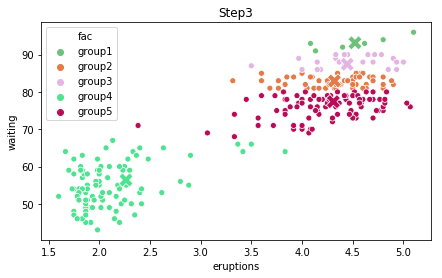

# At first we install all required packages:


```python
import numpy as np
import pandas as pd
import matplotlib.pyplot as plt
import operator
import seaborn as sns
import os
os.chdir('C:\\Users\\User\\Videos\\Finanzmathematik')
import random
import matplotlib.colors as cl
import copy
from sklearn.metrics import silhouette_samples, silhouette_score
```

Here we install data, with which we will test it:


```python
x =  pd.read_csv('faithful')
x.drop(['Unnamed: 0', 'fac'], inplace = True, axis=1) 
```

Thats our function for k-means algorithm:


```python
def k_means(x,k,trace=False,maxiter=10, change=0.001, silhouet=False):
     x1 =copy.deepcopy(x)
     index =  np.random.choice(range(0,len(x.index)), size=k, replace=False, p=None)
     centr = x.iloc[index,:]
     h =0
     def fun(x):
          return((np.sum([(np.abs(x[0]-centr.iloc[i,:][0]))**2,(np.abs(x[1]-centr.iloc[i,:][1]))**2]))**1/2)
     def funSilh(x):
          return((np.sum([(np.abs(x1.iloc[j,:][0]-x[0]))**2,(np.abs(x1.iloc[j,:][1]-x[1]))**2]))**1/2)
     r = lambda: random.randint(0,255)
     col = list() # here we define color to use in plotting.
     for i in range(0, len(index)):
        puf = '#%02X%02X%02X' % (r(),r(),r())
        if puf not in col:
           col.append(puf)
     zw_wert = [0.0001,0.0001]
     while True:
        dist = np.arange(len(x.index))
        puff = pd.DataFrame()
        for i in range(0,len(centr.index)):
            puff['group'+str(i+1)] = x.apply(axis=1, func = fun)
        fac = puff.apply(axis=1, func=lambda x:'group'+str(int(np.where(np.array(x)==min(np.array(x)))[0])+1))
        dist = puff.apply(axis=1, func = np.min)
        x1['fac'] = fac
        x1['dist'] =dist
        if h == 0:
            centr['fac'] = fac[index]
        if abs(sum(zw_wert)-sum(dist))/sum(zw_wert)< change:
            break
        else:
            if trace == True:
                if silhouet == True:
                    silh = silhouette_samples(x, fac)
                    x1['silh'] = silh
                    x1 = x1.sort_values(['fac','silh'], ascending = True)
                    y_low = 5
                    plt.figure()
                    fig,(ax0,ax1)=plt.subplots(nrows=1, ncols=2, sharey= True, figsize=(7,4))
                    ax0 = plt.subplot(121)
                    ax1=  plt.subplot(122)
                    r=0
                    for i in np.flip(np.unique(x1['fac']),axis=0):
                        y_up = y_low+len(x1.loc[x1['fac']==i].index)
                        ax0.fill_betweenx(np.arange(y_low,y_up),0,x1.loc[x1['fac']==i]['silh'],facecolor=np.flip(col, axis = 0)[r])
                        y_low = y_up + 5
                        r=r+1
                    ax0.set_title("Silhouette plot")
                    ax0.set_xlabel('Silhouettenkoeffizient')
                    ax0.set_ylabel('Cluster label')
                    ax0.set_yticks([])
                    ax0.set_ylim()
                if silhouet == False:
                       x1 = x1.sort_values(['fac'], ascending = True)
                       plt.figure()
                       fig,(ax1)=plt.subplots(nrows=1, ncols=1, sharey= True, figsize=(7,4))
                sns.scatterplot(x='eruptions', y='waiting', data=x1, hue = 'fac', ax=ax1,palette=col)
                sns.scatterplot(x='eruptions', y='waiting', data=centr, hue = 'fac', ax=ax1,s=200, marker = 'X', legend=False,palette=col)
                ax1.set_title('Step' + str(h+1))
        centr = x1.groupby('fac').mean()
        centr = centr.iloc[:,[0,1]]
        centr.reset_index(inplace = True)
        centr = centr.loc[:,('eruptions', 'waiting','fac')]
        
        zw_wert = dist
        h=h+1
        if h > maxiter:
             break
     output = {'iter':h,'Zentren':centr.iloc[:,[0,1]],'index':fac,'dist':dist}
     return(output)


```

Let's test our Algorithm:

We choose here 5 clusters with plot outputs (trace = True)


```python
k_means(x=x, k=5, trace = True)

```

    C:\Users\User\Anaconda3\lib\site-packages\ipykernel_launcher.py:27: SettingWithCopyWarning: 
    A value is trying to be set on a copy of a slice from a DataFrame.
    Try using .loc[row_indexer,col_indexer] = value instead
    
    See the caveats in the documentation: http://pandas.pydata.org/pandas-docs/stable/indexing.html#indexing-view-versus-copy
    C:\Users\User\Anaconda3\lib\site-packages\matplotlib\pyplot.py:514: RuntimeWarning: More than 20 figures have been opened. Figures created through the pyplot interface (`matplotlib.pyplot.figure`) are retained until explicitly closed and may consume too much memory. (To control this warning, see the rcParam `figure.max_open_warning`).
      max_open_warning, RuntimeWarning)
    


    {'iter': 11, 'Zentren':    eruptions    waiting
     0   4.540167  91.583333
     1   4.317527  79.645161
     2   4.403000  85.909091
     3   2.011299  53.287356
     4   3.667723  70.361702, 'index': 0      group2
     1      group4
     2      group5
     3      group4
     4      group3
     5      group4
     6      group3
     7      group3
     8      group4
     9      group3
     10     group4
     11     group3
     12     group2
     13     group4
     14     group2
     15     group4
     16     group4
     17     group3
     18     group4
     19     group2
     20     group4
     21     group4
     22     group2
     23     group5
     24     group5
     25     group2
     26     group4
     27     group2
     28     group2
     29     group2
             ...  
     242    group3
     243    group5
     244    group3
     245    group2
     246    group4
     247    group2
     248    group5
     249    group5
     250    group4
     251    group2
     252    group5
     253    group5
     254    group3
     255    group2
     256    group5
     257    group2
     258    group4
     259    group2
     260    group2
     261    group3
     262    group4
     263    group2
     264    group4
     265    group4
     266    group5
     267    group2
     268    group4
     269    group1
     270    group4
     271    group5
     Length: 272, dtype: object, 'dist': 0       0.791862
     1       0.276254
     2       3.830498
     3      37.991991
     4       1.189064
     5       1.846506
     6       1.105347
     7       1.525290
     8       2.617878
     9       1.186387
     10      0.269826
     11      3.351878
     12      2.078662
     13     19.799563
     14      4.467662
     15      0.840765
     16     37.989218
     17      3.291506
     18      0.913227
     19      0.538455
     20      2.638323
     21     19.799563
     22      2.446055
     23      2.823042
     24      4.018705
     25      4.649005
     26      1.467555
     27      8.170374
     28      2.180112
     29      0.543331
              ...    
     242     0.273053
     243    34.562560
     244     1.195620
     245     2.045302
     246     6.894432
     247     1.930569
     248    10.457291
     249     3.896948
     250     0.271735
     251     4.402627
     252     1.522034
     253     1.762131
     254     1.106376
     255     0.124569
     256     0.045792
     257     4.402627
     258     3.679282
     259     0.536859
     260     2.174283
     261     3.227525
     262    11.117514
     263     4.395598
     264    52.915250
     265    22.558282
     266     7.438627
     267     0.484497
     268    26.562400
     269     5.019419
     270    26.571657
     271     3.970932
     Length: 272, dtype: float64}


    <Figure size 432x288 with 0 Axes>


    <Figure size 432x288 with 0 Axes>


    <Figure size 432x288 with 0 Axes>





    <Figure size 432x288 with 0 Axes>


    <Figure size 432x288 with 0 Axes>


    <Figure size 432x288 with 0 Axes>


    <Figure size 432x288 with 0 Axes>


    <Figure size 432x288 with 0 Axes>


    <Figure size 432x288 with 0 Axes>


    <Figure size 432x288 with 0 Axes>


    <Figure size 432x288 with 0 Axes>


We see that it took 11 Steps to cluster this data in 5 groups.
Besides Plots we get other Output as well:

iter Anzahl der durchgeführten Iterationsschritte.

Zentren  Matrix der Dimension k x 2, welche für jede Teilmenge die Mittelwerte der beiden Variablen enthält

Index Vektor der Länge n, welcher für jeden Datenpunkt die Info enthält zu welcher Teilmenge er gehört

Distanz Vektor der Länge n, welcher für jeden Datenpunkt die Distanz zu dem Zentrum der Teilmenge, zu der er gehört, enthält


Now we want to run this function again but with 'silhouet=True' Silhouette coefficient, what gives us how good we clustered our data:


```python
k_means(x=x, k=5, trace = True,silhouet=True)

```

    C:\Users\User\Anaconda3\lib\site-packages\ipykernel_launcher.py:27: SettingWithCopyWarning: 
    A value is trying to be set on a copy of a slice from a DataFrame.
    Try using .loc[row_indexer,col_indexer] = value instead
    
    See the caveats in the documentation: http://pandas.pydata.org/pandas-docs/stable/indexing.html#indexing-view-versus-copy
    


    {'iter': 5, 'Zentren':    eruptions    waiting
     0   4.383593  86.372881
     1   2.064094  57.056604
     2   1.964486  48.675676
     3   4.336908  78.678161
     4   3.629194  69.944444, 'index': 0      group4
     1      group2
     2      group5
     3      group2
     4      group1
     5      group2
     6      group1
     7      group1
     8      group3
     9      group1
     10     group2
     11     group1
     12     group4
     13     group3
     14     group1
     15     group3
     16     group2
     17     group1
     18     group3
     19     group4
     20     group3
     21     group3
     22     group4
     23     group5
     24     group5
     25     group1
     26     group2
     27     group4
     28     group4
     29     group4
             ...  
     242    group1
     243    group2
     244    group1
     245    group4
     246    group2
     247    group4
     248    group5
     249    group5
     250    group2
     251    group1
     252    group5
     253    group5
     254    group1
     255    group4
     256    group5
     257    group1
     258    group2
     259    group4
     260    group4
     261    group1
     262    group2
     263    group1
     264    group3
     265    group2
     266    group4
     267    group4
     268    group3
     269    group1
     270    group3
     271    group5
     Length: 272, dtype: object, 'dist': 0       0.323307
     1       4.706286
     2       8.267631
     3      12.242543
     4       0.953563
     5       2.450113
     6       1.373814
     7       1.249411
     8       2.701347
     9       0.942966
     10      4.698116
     11      2.924138
     12      0.239323
     13      1.426947
     14      5.738221
     15      5.546072
     16     12.267911
     17      2.901980
     18      5.591991
     19      0.055567
     20      2.714770
     21      1.426947
     22      0.623254
     23      0.604019
     24      8.632198
     25      5.995173
     26      2.119523
     27      3.618508
     28      0.348491
     29      0.056407
              ...    
     242     0.220444
     243    18.011348
     244     0.962283
     245     5.644269
     246     0.001781
     247     5.517760
     248     5.454175
     249     8.483546
     250     4.680648
     251     5.690369
     252     4.670144
     253     5.047361
     254     1.351040
     255     1.008781
     256     0.598515
     257     5.690369
     258     0.560260
     259     0.053243
     260     0.322441
     261     2.826444
     262     0.467916
     263     5.697088
     264    16.106819
     265     4.349071
     266     6.849756
     267     2.719648
     268     3.596828
     269     6.578553
     270     3.590496
     271     8.574725
     Length: 272, dtype: float64}


    <Figure size 432x288 with 0 Axes>


    <Figure size 432x288 with 0 Axes>


    <Figure size 432x288 with 0 Axes>


    <Figure size 432x288 with 0 Axes>


    <Figure size 432x288 with 0 Axes>


As we see from our last Silhouette plot we clustered our data pretty well.
